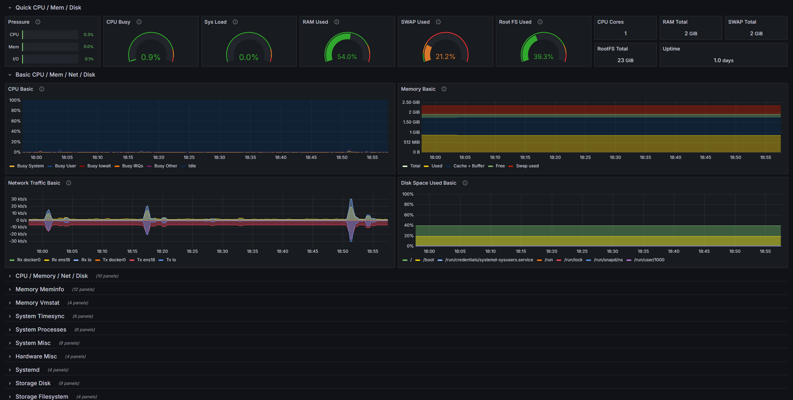
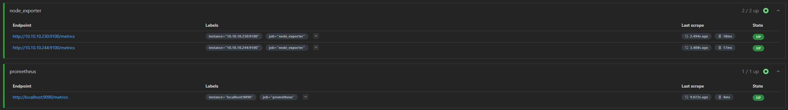

# Proxmox Observability Stack

This project provides a fully automated observability stack built on **Proxmox VE**. It uses **Terraform** to provision virtual machines and **Ansible** to configure the system and deploy **Prometheus**, **Grafana**, and **Node Exporter** using **Docker**.

The entire environment is managed as **Infrastructure as Code (IaC)** and can be recreated from scratch without manual configuration.


## 🚀 Key Features

* **Infrastructure as Code:** Virtual machine provisioning and lifecycle management handled with Terraform.
* **Cloud-init Based Provisioning:** Automated VM initialization with predefined user, SSH, and security configuration.
* **Automated System Bootstrap:** SSH hardening, user management, and base system setup performed via Ansible roles.
* **Dockerized Monitoring Stack:** Prometheus, Grafana, and Node Exporter deployed in a modular and reproducible way.
* **Dynamic Configuration Generation:** Prometheus targets and Grafana datasources/dashboards are generated automatically from the Ansible inventory during deployment.

## 🛠 Technology Stack
* **Virtualization:** Proxmox VE
* **Infrastructure Provisioning:** Terraform
* **Configuration Management:** Ansible
* **Monitoring:** Prometheus, Grafana, Node Exporter
* **Runtime:** Docker & Docker Compose

## 🏁 Deployment Flow

### 1. Environment Preparation
Before running the automation, you must prepare your Proxmox environment (API tokens, permissions, and VM templates).
> 📖 **Required Reading:** Follow the detailed steps in [terraform/docs/INSTRUCTIONS.md](terraform/docs/INSTRUCTIONS.md) and [terraform/docs/PROXMOX_TEMPLATE.md](terraform/docs/PROXMOX_TEMPLATE.md).

### 2. Provision Infrastructure
Navigate to the terraform directory to create the VM and generate the inventory:
```bash
cd terraform
terraform init
terraform apply
```
### 3. Deploy Monitoring Stack
Run the main playbook to configure the OS and start the containers:
```bash
cd ../ansible
ansible-playbook playbooks/site.yml
```
## 📊 Accessing the Stack
After a successful deployment, the services are available at:
- **Grafana:** http://<VM_IP>:3000  
  Default credentials: `admin / admin` (password change required on first login)

- **Prometheus:** http://<VM_IP>:9090  

- **Node Exporter:** http://<VM_IP>:9100/metrics  

---

## 📸 Monitoring in Action
Below are example screenshots of the deployed monitoring stack.

### Grafana Dashboard



The dashboard displays real-time CPU, memory, disk, and system metrics collected by Node Exporter and visualized through Grafana.

---

### Prometheus Targets



The Prometheus Targets page shows all monitored endpoints in the **UP** state, confirming that metrics are being successfully scraped from Node Exporter and Prometheus itself.

---

## 🎯 Project Goal

This repository demonstrates a reproducible DevOps workflow that combines infrastructure provisioning, system configuration, and monitoring deployment in a modular and automated way.

---

## 📄 License

This project is licensed under the MIT License.

You are free to use, copy, modify and distribute this project for learning or personal purposes.
No warranty is provided.

See the LICENSE file for details.